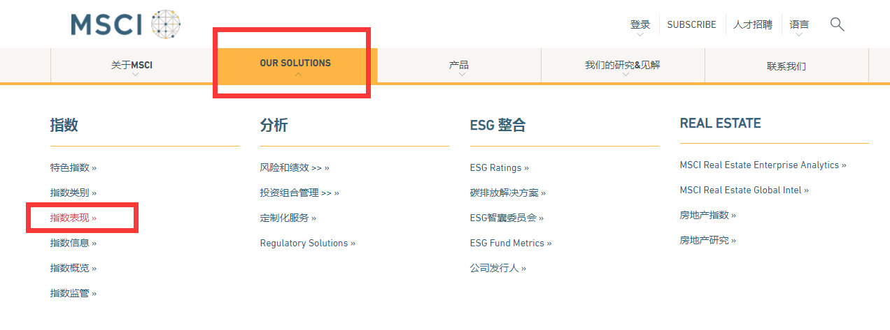
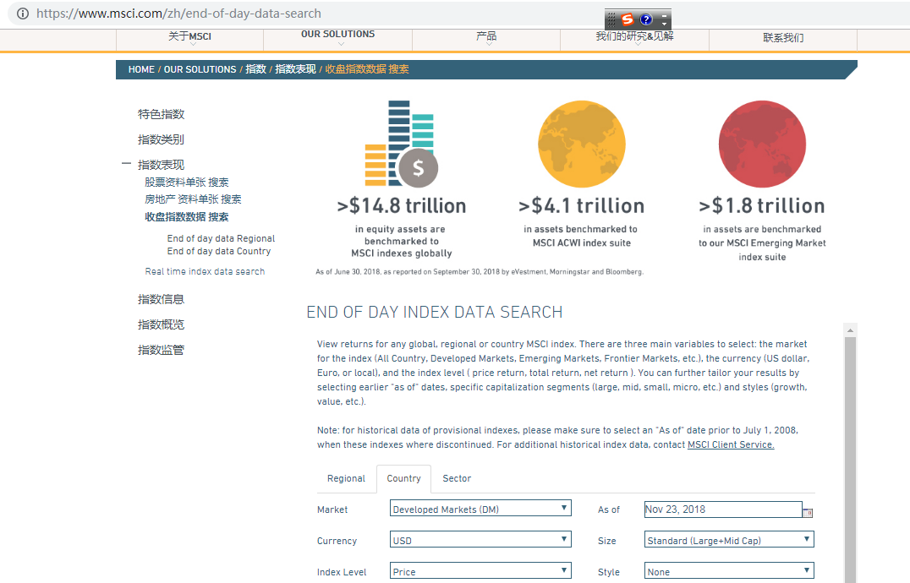
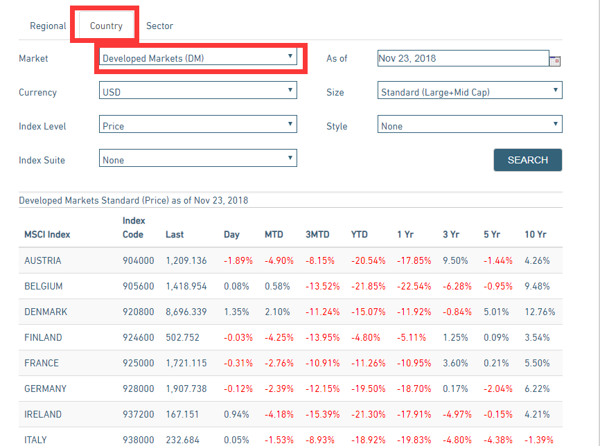
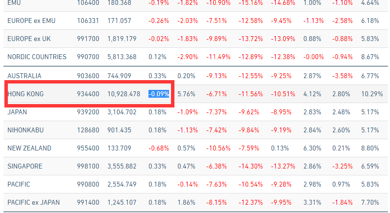
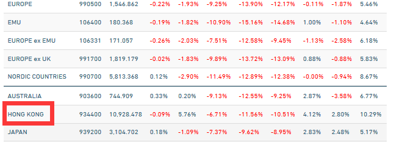
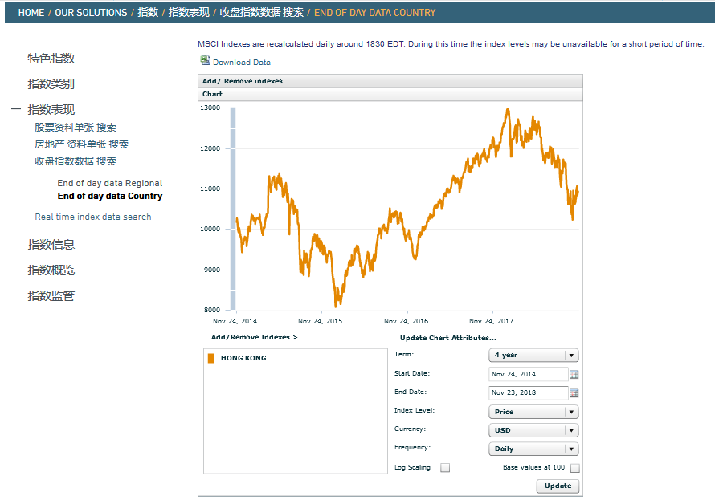

# ChinaClear
ChinaClear爬虫，将www.chinaclear.cn的每周数据定时整理，或许会有帮助

MSCI HK Index
=============
EWH.US 跟踪的是MSCI指数，非恒生指数，需要在网站获取。其中使用到了selemiun 模拟填入查询日期，点击查询按键，获取查询结果整个过程。
/markdown/MSCI 香港指标 .md

点击HONG KONG，必须使用firefox？googl点不出下面那个下载图

